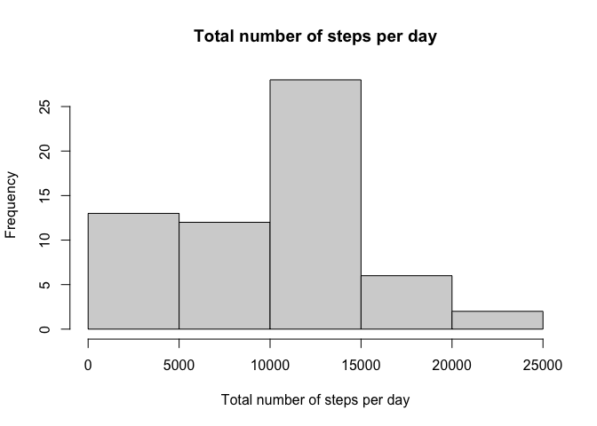
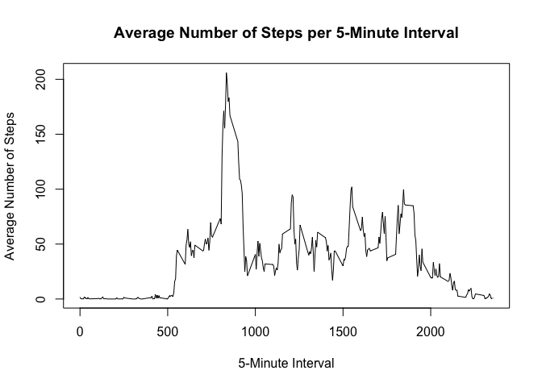
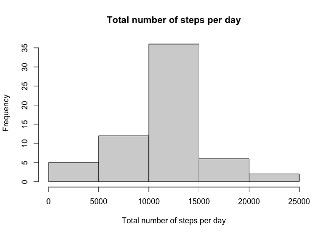
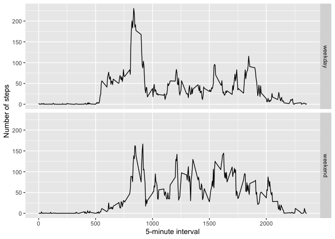

```r
library(dplyr)
library(ggplot2)
```


## Loading and preprocessing the data

```r
url <- "https://d396qusza40orc.cloudfront.net/repdata%2Fdata%2Factivity.zip"
temp <- tempfile()
download.file(url, temp, mode = "wb")
unzip(temp, exdir = "data")
data <- read.csv("data/activity.csv")
```
## What is mean total number of steps taken per day?

```r
total_data <- aggregate(data$steps, by=list(data$date), sum, na.rm=TRUE)
"date" -> names(total_data)[1]
"steps" -> names(total_data)[2]

hist(total_data$steps, xlab="Total number of steps per day", main="Total number of steps per day")
```

<!-- -->

```r
mean(total_data$steps, na.rm=TRUE)
```

```
## [1] 9354.23
```

```r
median(total_data$steps, na.RM=TRUE)
```

```
## [1] 10395
```


## What is the average daily activity pattern?


```r
interval_data <- aggregate(data$steps, by=list(data$interval), mean, na.rm=TRUE)
"5-minute interval" -> names(interval_data)[1]
"average number of steps" -> names(interval_data)[2]

plot(interval_data$`5-minute interval`,interval_data$`average number of steps`, type='l', xlab="5-Minute Interval", ylab="Average Number of Steps", main="Average Number of Steps per 5-Minute Interval")
```

<!-- -->

```r
interval_data %>% 
     filter(`average number of steps` == max(`average number of steps`)) %>% 
     select(`5-minute interval`)
```

```
##   5-minute interval
## 1               835
```


## Imputing missing values
Total Number of Missing Values:

```r
sum(!complete.cases(data))
```

```
## [1] 2304
```

```r
fill.value <- function(steps, interval) {
  filled <- NA
  if (!is.na(steps))
        filled <- c(steps)
  else
        filled <- (interval_data[interval_data$`5-minute interval`==interval,
                                  'average number of steps'])
        return(filled)
}
filled.data <- data
filled.data$steps <- mapply(fill.value, filled.data$steps, filled.data$interval)
```


```r
filled_data <- aggregate(filled.data$steps, by=list(filled.data$date), sum)
"date" -> names(filled_data)[1]
"steps" -> names(filled_data)[2]

hist(filled_data$steps, xlab="Total number of steps per day", main="Total number of steps per day")
```

<!-- -->

```r
mean(filled_data$steps)
```

```
## [1] 10766.19
```

```r
median(filled_data$steps)
```

```
## [1] 10766.19
```

## Are there differences in activity patterns between weekdays and weekends?

```r
weekday.or.weekend <- function(date) {
        day <- weekdays(date)
        if (day %in% c("Monday", "Tuesday", "Wednesday", "Thursday", "Friday"))
                return("weekday")
        else if (day %in% c("Saturday", "Sunday"))
                return("weekend")
        else
                stop("invalid date")
}
filled.data$date <- as.Date(filled.data$date)
filled.data$day <- sapply(filled.data$date, FUN=weekday.or.weekend)

averages <- aggregate(steps ~ interval + day, data=filled.data, mean)
ggplot(averages, aes(interval, steps)) + geom_line() + facet_grid(day ~ .) +
        xlab("5-minute interval") + ylab("Number of steps")
```

<!-- -->

